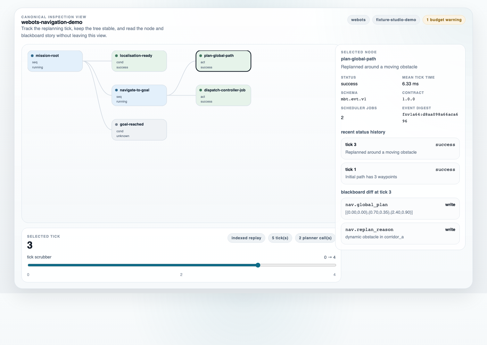
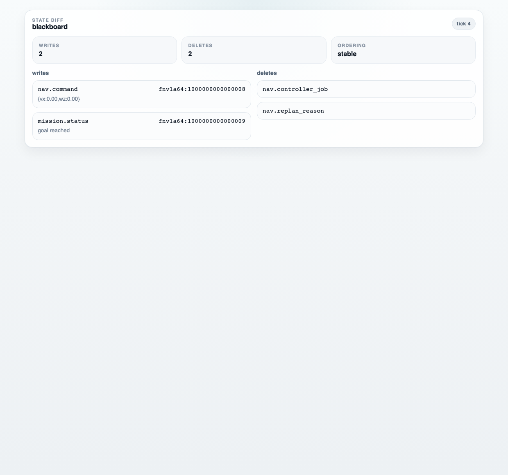

# muesli-studio

A monorepo for `muesli-studio` (web UI) and `mbt_inspector` (runtime bridge) around the canonical event stream `mbt.evt.v1`.
Current implemented scope is replay-first inspection plus live monitoring. Interactive editing workflows are planned and tracked in `TODO.md`.

## ui snapshot

Tree view with tick scrubber:



Blackboard diff at selected tick:



Refresh both screenshots with:

```bash
pnpm docs:screenshots
```

## current scope

Implemented in this milestone:

- monorepo layout (`apps`, `packages`, `schema`, `contracts`, `tools`)
- canonical schema/contract sourcing from the same resolved `muesli-bt` dependency used by inspector
- generated TypeScript protocol types + zod validation helpers
- replay engine package with JSONL ingest, indices, and query API
- replay-first studio app:
  - open `.jsonl`
  - tree rendering from `bt_def`
  - tick scrubber
  - node status colouring
  - blackboard diffs at selected tick
  - runtime DSL editor:
    - edit `bt_def.dsl` text
    - compile and apply updated tree definitions to the live replay view
    - revert to runtime-provided tree definition
    - save edited DSL via browser save picker (or download fallback)
- studio live monitoring:
  - connect to WebSocket endpoint (`ws://host:port/events`)
  - append live events to the same replay engine
  - auto-follow newest tick toggle
  - pause/resume via auto-follow toggle
  - connection status + last event time
  - auto-reconnect with exponential backoff
  - connection history controls for unstable links
- runtime-backed inspector (`apps/inspector`):
  - CMake target `mbt_inspector`
  - links `muesli_bt::runtime`
  - links `muesli_bt::integration_pybullet` when available
  - drives `bt::runtime_host` tick loop
  - forwards canonical runtime event lines to WebSocket and JSONL through one serialisation path
  - integration test proving WS/JSONL payload equivalence in deterministic mode
- CI checks for schema/contract drift against the resolved `muesli-bt` source
- contract-consumption foundations:
  - consumer requirements checklist (`docs/studio/contract-consumption.md`)
  - version gating for contract/schema compatibility (`packages/replay/src/version-gate.ts`)
  - deterministic run summary generation with stable digest (`packages/replay/src/summarise-run.ts`)
- fixture bundle support:
  - bundle loader for `manifest.json` + `events.jsonl` (+ optional config/seed/expected metrics)
  - subprocess log validation integration (`tools/validate_log.py`) with deterministic AJV fallback
  - sidecar tick index support (`mbt.sidecar.tick-index.v1`) with indexed parse fallback for very large logs
  - imported golden bundle fixtures from `muesli-bt` main:
    - `tests/fixtures/budget_warning`
    - `tests/fixtures/deadline_cancel`
    - `tests/fixtures/determinism_replay`
  - deterministic large replay fixture for sidecar/index strategy checks:
    - `tests/fixtures/large_replay` (30,002 canonical events)
    - regenerated with `pnpm fixtures:large`
    - includes `events.sidecar.tick-index.v1.json`
  - sidecar benchmark harness and baseline report:
    - run `pnpm bench:sidecar`
    - check-only mode: `pnpm bench:sidecar -- --check`
    - output at `tests/benchmarks/sidecar-large_replay.json`
  - fixture summary regression tests using stored `expected_summary.json`
  - minimal CLI: `studio inspect <bundle_dir>` for bundle sanity checks and `run_summary.json` emission
  - Node-only replay entrypoint for bundle/validator features: `@muesli/replay/node`

## muesli-bt pinning

Inspector pin metadata lives in [`apps/inspector/cmake/MuesliBtVersion.cmake`](./apps/inspector/cmake/MuesliBtVersion.cmake).

- default CI and local fallback builds use that pinned URL/tag
- scheduled CI builds inspector against `muesli-bt` `main` (advisory)
- canonical contract reference: [muesli-bt studio integration contract](https://github.com/unswei/muesli-bt/blob/main/docs/contracts/muesli-studio-integration.md)

## try it now

```bash
pnpm install && pnpm demo
```

`pnpm demo` stages a known deterministic fixture bundle, validates it with `studio inspect`, starts studio, and opens the browser with the replay preloaded.

## quick start (full dev setup)

```bash
pnpm install
pnpm inspector:configure
pnpm sync:schema
pnpm sync:contract
pnpm gen:types
pnpm check:fixtures
pnpm test
pnpm build
pnpm --filter @muesli/studio dev
```

### inspect fixture bundles

```bash
pnpm studio inspect tests/fixtures/determinism_replay --out /tmp/run_summary.json
```

This command validates the bundle, prints a concise summary, and writes `run_summary.json` when `--out` is provided.
When the bundle sits under `tests/fixtures/<name>`, the CLI auto-uses `tests/fixtures/schema/mbt.evt.v1.schema.json`.

For the quick UI demo fixture:

```bash
pnpm studio inspect tests/fixtures/studio_demo
```

To refresh the large deterministic stress fixture used for sidecar/index planning:

```bash
pnpm fixtures:large
pnpm studio inspect tests/fixtures/large_replay --out /tmp/large_run_summary.json
pnpm bench:sidecar
```

### replay mode

Load either:

- a canonical JSONL fixture (`tools/fixtures/minimal_run.jsonl`), or
- a validated bundle event log (`tests/fixtures/*/events.jsonl`) after running `studio inspect`.

Studio replay load supports an optional sidecar index file (`events.sidecar.tick-index.v1.json`). The UI now shows load progress, indexed/unindexed state, and warns when large logs fall back to unindexed full-scan ingest.
For large indexed logs, studio now enables lazy sidecar-backed tick parsing so replay opens quickly and loads additional tick ranges when selected.

The replay panel also includes a DSL editor for `bt_def.dsl`. Use:

- `apply` to compile and replace the rendered tree immediately
- `revert` to restore the runtime-provided definition
- `save` to export the edited DSL for runtime-side use

The demo launcher uses URL query auto-load:

- `demo_fixture=/demo/<fixture>/events.jsonl`
- optional `demo_sidecar=/demo/<fixture>/events.sidecar.tick-index.v1.json`

### live mode

```bash
cmake --preset default -S apps/inspector
cmake --build apps/inspector/build --config Release
apps/inspector/build/mbt_inspector --attach mock --ws :8765 --run-loop '{"max_ticks":200}' --tick-hz 20 --log /tmp/live.jsonl
pnpm inspector:test
```

Then connect studio to `ws://localhost:8765/events`.

## replay package entrypoints

- browser/UI consumption: `@muesli/replay`
- Node tooling consumption (bundle loader + subprocess validator): `@muesli/replay/node`

## studio docs

- consumer contract checklist: `docs/studio/contract-consumption.md`
- fixture bundle workflow and CLI: `docs/studio/fixture-bundles.md`
- sidecar tick-index format and usage: `docs/studio/sidecar-index.md`
- studio replay mode: `apps/studio/docs/replay.md`
- studio live monitoring: `apps/studio/docs/live.md`

## local install vs fetchcontent

Inspector resolution order:

1. `find_package(muesli_bt CONFIG QUIET)`
2. if not found, `FetchContent` using the pinned URL/tag

No manual include/library path overrides are needed.

## repository layout

```text
schema/              # canonical event schema copy used by studio tooling
contracts/           # canonical integration contract copy
apps/studio/         # replay-first React + Vite UI
apps/inspector/      # C++ runtime bridge (muesli-bt + ixwebsocket)
docs/studio/         # studio-facing contract and workflow docs
packages/protocol/   # generated types, zod validation, protocol helpers
packages/replay/     # parser/index/query for append-only event ingestion
packages/ui/         # shared UI bits
tests/fixtures/      # bundle fixtures + golden summaries for regression checks
tests/benchmarks/    # sidecar benchmark baselines
tools/gen_types/     # schema->types generation scripts
tools/bench/         # sidecar benchmark tooling
tools/fixtures/      # canonical fixture logs
tools/studio         # studio CLI wrapper (`studio inspect`)
tools/sync_schema.sh # sync schema from resolved muesli-bt source
tools/sync_contract.sh # sync contract from resolved muesli-bt source
```
