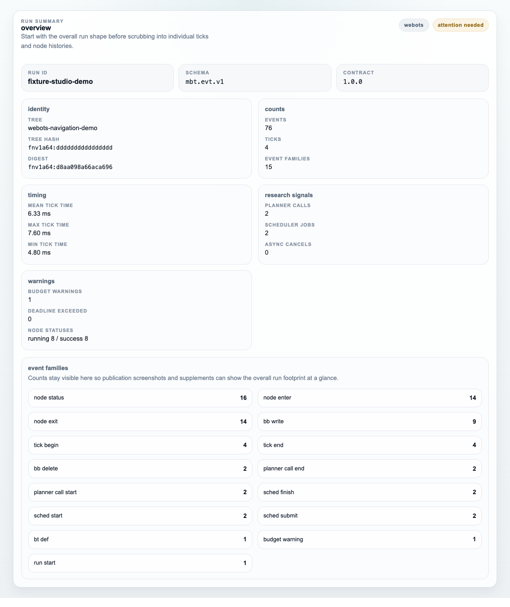
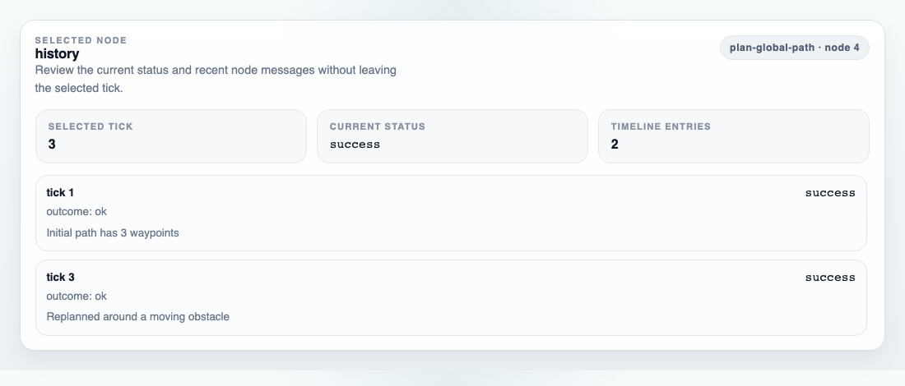

# muesli-studio

**Replay and monitor behaviour trees.**

`muesli-studio` is the inspector for [`muesli-bt`](https://github.com/unswei/muesli-bt). Open a recorded run, scrub ticks, inspect node state, examine state changes, or follow live events over WebSocket.

Compatibility target: `muesli-bt v0.3.1` release line and the pinned fallback commit in [`apps/inspector/cmake/MuesliBtVersion.cmake`](apps/inspector/cmake/MuesliBtVersion.cmake).

[Try the demo](#try-it-now) · [Download releases](https://github.com/unswei/muesli-studio/releases) · [Read the docs](#documentation)


*Studio overview during replanning.*

## try it now

From the repo root:

```bash
pnpm install && ./start-studio.sh
```

Starts the studio with the deterministic Webots-flavoured demo bundle preloaded in the browser, opens the indexed replay at tick `3`, and preselects `plan-global-path` so the first screen already shows replanning pressure, state changes, and node context.

`pnpm demo` remains available as a shorthand for the same path.

## what you can do

### replay runs

Open a recorded run, scrub through ticks, and inspect behaviour tree execution over time.

### inspect state

See the run summary first, inspect node statuses, examine blackboard diffs, and check exactly what changed at the selected tick.

### capture and share

Switch into presentation mode, export clean PNG or SVG figures, and write a compact publication bundle with replay data, summary metadata, and screenshots.

### follow live

Connect to a running system over WebSocket and follow new events as they arrive through the same inspector.

## built for [muesli-bt](https://github.com/unswei/muesli-bt)

`muesli-studio` is the visual inspector for [`muesli-bt`](https://github.com/unswei/muesli-bt). Replay and live monitoring use the same canonical event stream, so a recorded run and a live session share the same inspection model.

## why this is reliable

- deterministic fixture bundles drive the demo, screenshot capture, and regression checks
- replay and live monitoring share the same `@muesli/replay` event model
- schema and contract sync are checked against the resolved [`muesli-bt`](https://github.com/unswei/muesli-bt) source in CI
- the runtime-backed inspector proves WebSocket and JSONL payload parity in deterministic integration tests
- tagged releases publish source archives plus prebuilt Linux Intel and macOS Apple Silicon bundles

## more views

Run summary:



*Run summary with tree identity, timing, warnings, and event-family counts.*

Node inspector:



*Node history for the replanning node at the canonical demo tick.*

Blackboard diff at the selected tick:


*Blackboard diff for the selected tick.*

Refresh the README screenshots with:

```bash
pnpm docs:screenshots
```

## releases

Tagged releases matching `v*` publish these artefacts:

- source (`.tar.gz` and `.zip`)
- Linux Intel binary bundle
- macOS Apple Silicon binary bundle

First release: `v0.1.0`.

See [GitHub releases](https://github.com/unswei/muesli-studio/releases) and [release targets](docs/studio/release-targets.md) for workflow and asset naming.

Recommended assets:

- local inspection on Linux Intel: `muesli-studio-<version>-linux-intel.tar.gz`
- local inspection on macOS Apple Silicon: `muesli-studio-<version>-macos-arm.tar.gz`
- source review or packaging audit: `muesli-studio-<version>-source.tar.gz` or `.zip`

After unpacking a binary bundle, start the packaged UI with:

```bash
./start-studio.sh
```

Verify a downloaded archive before launching it:

```bash
shasum -a 256 -c muesli-studio-<version>-<target>.tar.gz.sha256
```

The release bundle also includes `RELEASE.md` with the packaged target, version, compatibility line, and launch reminder.

## documentation

- [consumer contract checklist](docs/studio/contract-consumption.md)
- [fixture bundle workflow and CLI](docs/studio/fixture-bundles.md)
- [publication workflow](docs/studio/publication-workflow.md)
- [large log workflow](docs/studio/large-logs.md)
- [sidecar tick-index format and usage](docs/studio/sidecar-index.md)
- [release targets and artefacts](docs/studio/release-targets.md)
- [release verification](docs/studio/release-verification.md)
- [release notes](docs/studio/release-notes.md)
- [roadmap to 1.0](docs/roadmap-to-1.0.md)
- [studio replay mode](apps/studio/docs/replay.md)
- [studio live monitoring](apps/studio/docs/live.md)

## installation and development

```bash
pnpm install
pnpm inspector:configure
pnpm sync:schema
pnpm sync:contract
pnpm gen:types
pnpm check:fixtures
pnpm test
pnpm build
pnpm --filter @muesli/studio dev
```

## inspect fixture bundles

```bash
pnpm studio inspect tests/fixtures/determinism_replay --out /tmp/run_summary.json
```

This validates the bundle, prints a concise summary, and writes `run_summary.json` when `--out` is provided. When a bundle sits under `tests/fixtures/<name>`, the CLI auto-uses `tests/fixtures/schema/mbt.evt.v1.schema.json`.

For the canonical UI demo fixture:

```bash
pnpm studio inspect tests/fixtures/studio_demo
```

To refresh the large deterministic stress fixture used for sidecar planning:

```bash
pnpm fixtures:large
pnpm studio inspect tests/fixtures/large_replay --out /tmp/large_run_summary.json
pnpm bench:sidecar
```

## replay mode

Load either:

- a canonical JSONL fixture (`tools/fixtures/minimal_run.jsonl`)
- a validated bundle event log (`tests/fixtures/*/events.jsonl`) after running `studio inspect`

Studio replay load supports the optional sidecar index file `events.sidecar.tick-index.v1.json`. The UI shows load progress, indexed or unindexed state, and warns when large logs fall back to full-scan ingest.

Large indexed replays now bootstrap lazily for both local files and URL auto-loads. File loads use `File.slice`; URL loads use HTTP byte ranges when the host supports them.

The replay panel also includes a DSL editor for `bt_def.dsl`. Use `apply` to replace the rendered tree immediately, `revert` to restore the runtime definition, and `save` to export the edited DSL.

Replay mode now includes a first-class run summary panel for versions, tree identity, timings, warning counts, planner/scheduler activity, and deterministic digests.

Replay mode also includes an in-app diagnostics panel for large-log replay mode, recent seek latency, and rough replay memory use.

Replay mode also includes a first-class presentation flow in the right rail. Use it to open clean overview, summary, node, diff, or DSL layouts, then export PNG, SVG, or a zipped publication bundle.

The demo launcher uses URL query auto-load:

- `demo_fixture=/demo/<fixture>/events.jsonl`
- optional `demo_sidecar=/demo/<fixture>/events.sidecar.tick-index.v1.json`
- optional `demo_tick=<n>` and `demo_node=<id>` for deterministic screenshot or demo state selection
- optional `demo_capture=hero|summary|node|diff|dsl` for deterministic README and panel capture views

Canonical repo demo state:

- `demo_fixture=/demo/studio_demo/events.jsonl`
- `demo_sidecar=/demo/studio_demo/events.sidecar.tick-index.v1.json`
- `demo_tick=3`
- `demo_node=4`

## live monitoring

```bash
cmake --preset default -S apps/inspector
cmake --build apps/inspector/build --config Release
apps/inspector/build/mbt_inspector --attach mock --ws :8765 --run-loop '{"max_ticks":200}' --tick-hz 20 --log /tmp/live.jsonl
pnpm inspector:test
```

Then connect studio to `ws://localhost:8765/events`.

## replay package entrypoints

- browser or UI consumption: `@muesli/replay`
- Node tooling consumption: `@muesli/replay/node`

## [muesli-bt](https://github.com/unswei/muesli-bt) pinning

Inspector pin metadata lives in [`apps/inspector/cmake/MuesliBtVersion.cmake`](./apps/inspector/cmake/MuesliBtVersion.cmake).

- default CI and local fallback builds use that pinned URL and commit
- current pinned commit: `050c5e8793052d2a1a5d307897960d8b78e2afbc` (tagged `v0.3.1`)
- scheduled CI builds inspector against [`muesli-bt`](https://github.com/unswei/muesli-bt) `main` as an advisory check
- canonical contract reference: [muesli-bt studio integration contract](https://github.com/unswei/muesli-bt/blob/main/docs/contracts/muesli-studio-integration.md)

## local install vs fetchcontent

Inspector resolution order:

1. `find_package(muesli_bt CONFIG QUIET)`
2. if not found, `FetchContent` using the pinned URL and commit

No manual include or library path overrides are needed.

## repository layout

```text
schema/                # canonical event schema copy used by studio tooling
contracts/             # canonical integration contract copy
apps/studio/           # replay-first React + Vite UI
apps/inspector/        # C++ runtime bridge (muesli-bt + ixwebsocket)
docs/studio/           # studio-facing contract and workflow docs
packages/protocol/     # generated types, zod validation, protocol helpers
packages/replay/       # parser, index, and query API for append-only event ingestion
packages/ui/           # shared UI bits
tests/fixtures/        # bundle fixtures + golden summaries for regression checks
tests/benchmarks/      # sidecar benchmark baselines
tools/gen_types/       # schema-to-types generation scripts
tools/bench/           # sidecar benchmark tooling
tools/fixtures/        # canonical fixture logs
tools/studio           # studio CLI wrapper (`studio inspect`)
tools/sync_schema.sh   # sync schema from resolved muesli-bt source
tools/sync_contract.sh # sync contract from resolved muesli-bt source
```

## current scope

The current release focuses on replay-first inspection and live monitoring. The studio also includes a lightweight DSL editor for swapping rendered tree definitions during inspection, while deeper authoring workflows remain out of scope for now.

The broader release plan is tracked in [docs/roadmap-to-1.0.md](docs/roadmap-to-1.0.md).
